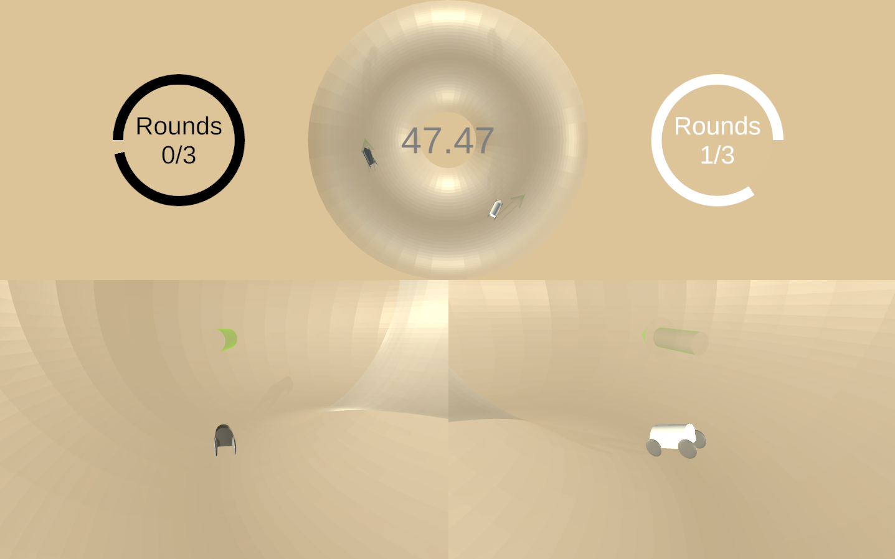
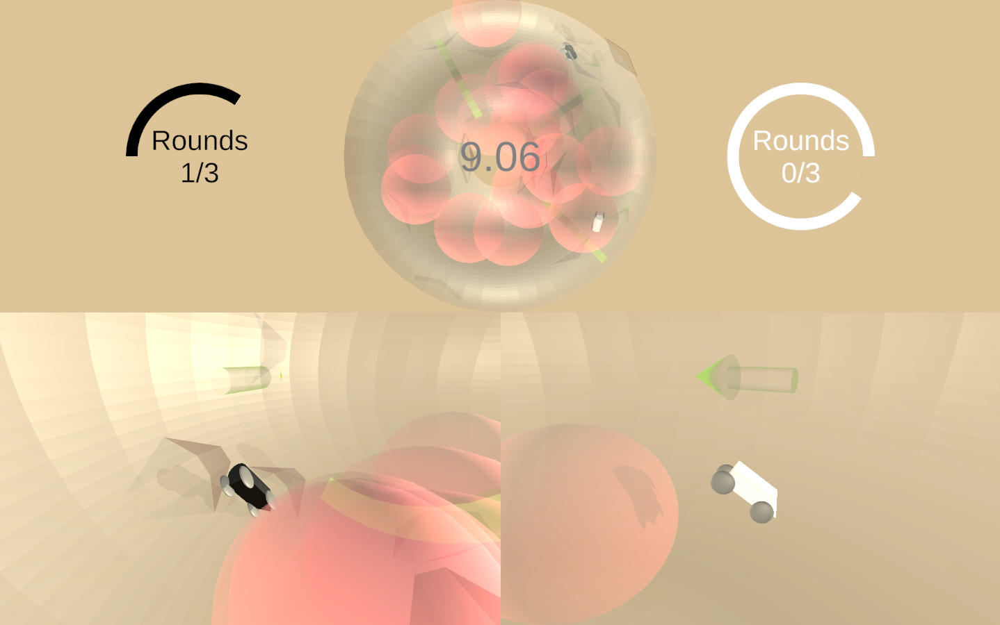
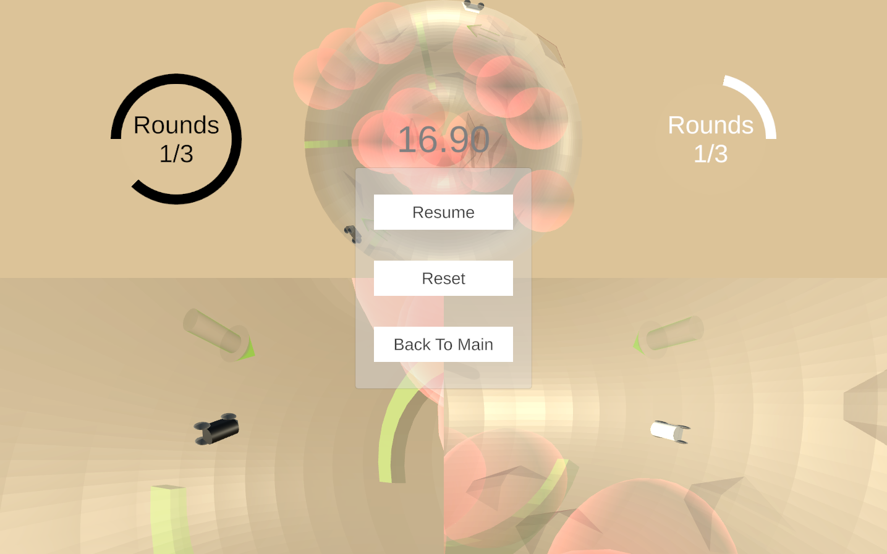
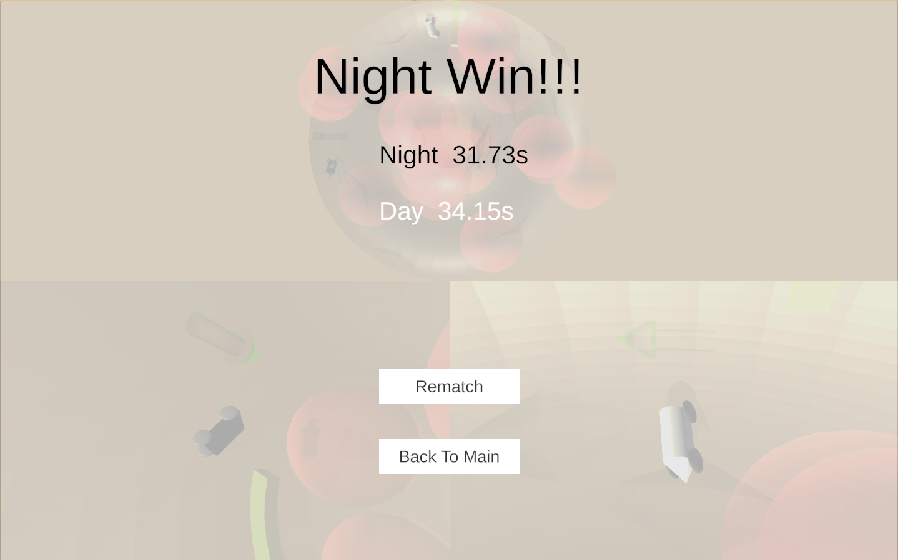

# Donart  

## Intro
Using Unity 2022.3.8f1, By Zongying Liu.  

Donart (Donut cart) is a racing game, where two players could add different things (toppings) to the donut track and then race.  

There are two scenes in this game, "MainMenu" and "Game". Players will first select toppings in the "MainMenu" scene to make the level, then start racing in the "game" scene.

## How to Boot  

For Unity users, please go to```./Assets/Scenes/MainMenu```, and start to play from this scene.

## Gameplay  

### 1. Make Your Level  

In "MainMenu" scene, you can select what you want in the donut track. You can choose from none to all of them.  

* Chocolate Bump: Brown static bump staying at a random position on the surface of the donut track.   

* Melon Slide: Green "accelerator" appears and rotates at a random position within the donut track. It will accelerate cars passing through it.  

* Cherry Boom: Pink booms, appearing and moving at a random position on the surface of the donut track. It will burst and impact all cars with the explosion range, and then appear somewhere else.  

*Chocolate Bump, Melon Slide, Cherry Boom and All.*  

After selecting, you can press the "Start!" button to load the level you made.

### 2. Racing  

In the "Game" scene, there is a top-down view of the whole track and two views of two players in the lower half of the screen.  

The black car for Player 1 and the white car for Player 2 will be initialized at the left and right parts inside of the donut track. 
The black car should go clockwise while the white car should go counterclockwise. 

There is also a green arrow for each car, indicating the correct direction the car should go.
*In Game layout*


The racing starts right away when the scene is loaded. the time starts counting as well.

Since the track is a circle, the progress for each car is counted in degrees from its initial position to its current position.   

The number of completed rounds is also counted for each car. 
*In Game UI*

By pressing ```WASD``` and ```up, down, left, right arrow```, try your best to avoid the bumps, catch the slides, recover balance after being blown away from the booms, and complete more rounds as fast as you can.
*Chaotic but fun*

You can also press the ```Esc``` key to pause the game.
*Pause panel*

When both players have completed a certain number of rounds (for now 3), results will be shown, and who finished faster is the winner. And then you can choose to rematch or go back to the main menu.
*Result Panel*

## Operation
### 1. In the main menu
Just use the mouse to click on the button.

### 2. In-game
For player 1 to control the black car. press ```WASD```.  
For player 2 to control the white car. press ```up, down, left, right arrow```.

To pause the game, press ```Esc``` button and the pause menu will be shown while the game is paused.

## Game Logic

### 1. Car
The car in this game is made based on Unity Physics with rigid body, controlled by Unity new input system, followed by a cinemachine free look camera.  

The attached ```carController``` calculates the suspension, steering, and acceleration.  
The attached ```carInputHandeler``` lerps the input from the input system.  
The attached ```carStatus```determines the driving direction (clockwise or counterclockwise) and counts the progress in degree and the rounds the player has finished.


### 2. Torus (the donut track)
Based on its major radius R, minor radius r, and local scale, the torus can give a position and rotation on its surface, with which the children ```BumpManager```, ```AcceleratorManager```, ```BoomManager``` could instantiate the bump (chocolate bump), accelerator (melon slide) and boom (cherry boom) correctly on the torus surface. 

The three managers mentioned above will manage the behavior of the prefabs they instantiated.

### 3. Game Manager
Determine which topping should be added to the donut track, according to the scriptable object ```GameSettings``` which was modified previously in the main menu scene through the toggle buttons.  
Determine how many rounds a car should complete.  
Determine game states by watching the status of 2 cars.

### 4. UI
Show different panels according to game states and player input.  
Display important game data from the game manager.


## Insperation

Car physics:   
https://www.youtube.com/watch?v=CdPYlj5uZeI&t=51s&ab_channel=ToyfulGames  

Math for torus:  
https://en.wikipedia.org/wiki/Torus

Button animation:  
https://www.youtube.com/watch?v=cW-E4WEogzE&ab_channel=CocoCode


## Dependency
This project uses Unity 2022.3.8f1, in URP.  
Packages installed:   
* TextMeshPro
* Input System
* Cinemachine
* Universal RP
* Shader Graph

Models are all self-made in Blender.

## Lastly
Wish you have fun in my game! - Zongying Liu